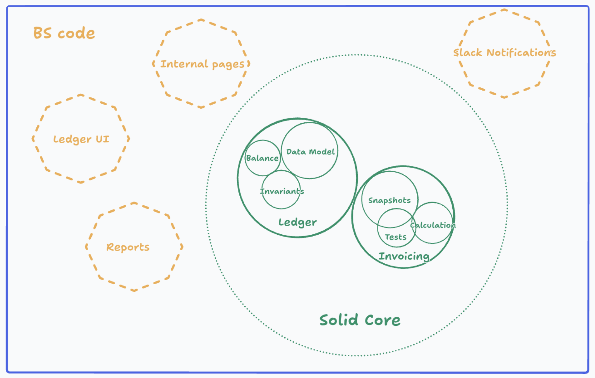

This will take place in multiple parts. Do one part a time.

TLDR:
# User needs & requirements
Before using an LLM, I write my thinking about what the user requirements are.
Then, I have the LLM generate User requirements using Linear ticket without my answer.
I compare LLM's answer to mine -> debate until we agree. 

# Unit tests / Invariants
Similar process as above but for unit tests.
I write my thoughts first -> have LLM generate answer independently -> compare and discuss.
Syntax of the unit tests does not matter (use pseudocode). 
Thinking through the edge cases and core behaviors is most important.

# File Exploration
I tell the agent to exhaustively find all possibly relevant files. 
Not doing this can cause agent to miss existing implementations. 
Having a pass for LLM to only search gives it better context imo.

# Pseudocode
I then have AI generate pseudocode focusing on these things:
- Types
- Interfaces
- Invariants
- Core functions implementation
- Function signatures of all new or edited functions (ask AI to show on diagram how data passes between them)
- Data model (database)
- Server load / actions
- High risk boundaries (where will things blow up)
- Performance
I'll review the plan and critique it. I don't create this myself first for velocity sake.

# Adversarial Review
Have agent with fresh context critique my plan, propose alternative approaches I missed, and list all the approaches and their tradeoffs.
I only do this once for velocity.

# My Brain dump: 

# PART 1
first we will discuss on understanding the user problem and the requirements, from a user perspective. we're not talking about any code rn and are only talking about the requirements from the user perspective and how itd finally look on the UI.

# PART 2
*responded to questions regarding implementation details and user requirements*
this is the plan so far. we should also think about unit tests to implement. lets start discussing what tests we'll have via pseudo code
we want to discuss what the invariants are. we want to capture edge cases. we want to capture core tests that will satisfy the user requirements

# PART 3
*finished writing tests*

before pseudocode, lets discuss all the possible relevant files. without any implementation show me all relevant files and code you think may be possible. do not just show for one implementation show for multiple possible implementations if relevant

show me the relevant types, interfaces, functions, classes, etc that you think would be related to this. the goal is getting a survey of how things exist

you must show me relevant files AND the relevant files must be paired with code snippets. 
first give a high level overview of the files.
then for each file provide the relevant code snippets.
be exhaustive in this survey.

# PART 4
now we will discuss this via pseudocode. reference the /show-me styling purely for how you will use pseudocode and diagrams.
some main focuses we care about (non-exhaustive):
- types
- interfaces
- invariants
- core functions / abstractions (especially pure functions / methods if any). signatures + pseudo
- signatures of all relevant functions / methods and how they are connected / call each other / pass data between each other
- data model (database)
- server actions/load
- high risk boundaries
- performance

i will send you the above message. while you are generating, i will generate my own approach and thinking. this will likely be wrong but it is me trying to generate my initial thinking. do not consider it to be the first approach.

i will then compare my approach with your generation, and we will discuss and agree on a 1st approach.

# Part 5 | Slava's guide for coding
Review Slava's recommendations for AI coding. 
See if there's anything we missed during our discussion that should be covered below. 
Be very rigorous with this and pay extra attention.

AI can make us significantly faster engineers—but only when we give it the right context and manage the work deliberately. When AI feels slow, expensive, or “not smart enough,” the problem is often not the model. More commonly, we have skipped the work that makes good engineering (and good AI collaboration) possible.

Before starting, decide whether the session is primarily for **exploration** or for **getting something done**.

<aside>
🧑‍🔬

Exploration should be:

Broad and problem-based - encourage the agent to collect more understanding of the existing patterns, metrics from DataDog, DB shapes.

State the scope size you are ready to work through: e.g. “a small deployable fix during an incident” or “a job to finish within 10min” etc.

Point at known constraints or assumptions: e.g. “there are ~1M claims but only ~15k groups, prefer scaling with the groups set size, not claims“ etc.

</aside>

<aside>
👷‍♂️

Execution should be:

Focused - introduce 1 command, or switch one pattern to another, or build a new UI surface.

Bite-sized - a human reviewer should be able to tell quickly if the overall shape makes sense or needs a bigger pivot.

Aligned with a plan - if you don’t have a plan, that’s a tell.

</aside>

## 1. Do the thinking before opening an AI session

Before asking AI to write code, make sure you understand the problem you are trying to solve.

At minimum, get a sense of:

- What behavior needs to change?
- Who or what depends on the current behavior?
- What are the important business rules?
- What data enters and leaves the system?
- What must remain unchanged?
- How will we know the change is correct?
- What are the risks if we get it wrong?

For example, “add support for a new payment status” is not enough context. We should also understand:

- Which payment states already exist?
- Are transitions one-way or reversible?
- Is the operation idempotent?
- What happens when a webhook is delivered twice?
- Does the status affect member balances, ledger entries, reconciliation, or notifications?
- What audit trail is required?

AI can help discover answers, but it should not be responsible for inventing the questions.

## 2. Give AI a focused, well-defined job

Large, vague requests create long, expensive sessions and low-quality output. Instead of asking:

> “Understand this service and implement the payment workflow.”
> 

Start with focused tasks:

> “Read these three files and summarize the current payment state transitions. Do not make changes.”
> 

Then:

> “Based on that summary, identify the smallest set of files that would need to change to support `returned` payments. Call out any uncertainty.”
> 

Then:

> “Propose tests for the transition rules. Do not write production code yet.”
> 

This approach gives us checkpoints. It also makes it easier to notice when the model has misunderstood the domain before that misunderstanding becomes code.

A useful rule is: **one session, one objective**.

## 3. Manage sessions like engineering work

AI sessions accumulate context, assumptions, and mistakes. Long sessions are not automatically better. Once a session becomes confused, repetitive, or slow, continuing to add messages often makes the result worse (the transformer architecture does not scale well to long-context tasks).

Start a new session when:

- The goal has changed.
- The model is repeatedly making the same incorrect assumption.
- The conversation contains too much irrelevant exploration.
- You have learned important new context that should be stated cleanly.
- You are moving from investigation to implementation or from implementation to review.

Most AI agents have the `/compact` feature but occasionally you might want to do “compaction” yourself, by starting a completely fresh session and restating the problem and known constraints yourself, with your own emphasize on what’s important.

## 4. Invest into good tests / ergonomic test setups

I have previously tried to instill these principles into our repo’s `TESTING.md` but it is not applied consistently by agents.

AI loves writing BS tests and most of them look like this:

```jsx
function testFunctionX() {
  vi.mock(someDependency);
  x();
  expect(someDependency).toHaveBeenCalledTimes(5);
}
```

It’s a very brittle and almost useless test pattern, that just validates that the control flow works the way the AI expected.

It doesn’t help you capture the business requirements that stay the same as the code changes.

A better test structure is:

```jsx
function testFunctionX() {
  // setup DB to simulate the relevant business situation
  db.state.create({...});
  
  // craft the test input that simulates a very specific edge case
  const craftedInput = { ... };
  
  // execute the code
  const output = x(craftedInput);
  
  // validate the persisted changes or outputs
  expect(output).toBeEqual(...);
  expect(db.state.get(...)).toBeEqual(...);
}
```

Good tests give you more long-term confidence that AI can’t screw up too much and you don’t need to carefully think through every tiny change.

A good test in the PR also helps to review the change just based on the covered business cases, not worrying to much about the specifics as long as the general architecture of the change makes sense.

## 5. Macro: improve your own domain knowledge and architectural familiarity with your codebase

In practice my observation is that the AI token spend is correlated with how junior the engineer is, without increase in productive output.

This implies that AI is a much better force multiplier for senior engineers.

My theory is that the point of diminishing returns is reached much much sooner by junior engineers, as they are stuck in some local maxima for a problem-solving process, they struggle to decompose the problem correctly or to make simpler decisions that don’t over-engineer the solution.

Here are some high-level concepts that are useful to internalize and optimize for strategically over a longer period of time at the company.

### Solid Core

In good systems there is always a slowly growing “solid core” that should be grown slowly, intentionally and with a lot of care for consequences. Solid Core has good artisanal human-sourced tests (tm).



For example, for Ledger, the solid core is:

- data model of the ledger (accounts, transactions, pairs, entries)
- core functionality that’s correct and performant (balance sums, lookup indexes)

Outside of the solid core there is BS code:

- acts as a “presentation” layer on top of the solid core
- low blast radius
- easy to write, change, rewrite, delete, reorganize

Examples of BS on top of ledger are surface areas like: financial reports, UI pages, backfills, internal tools and one-off internal pages.

Sometimes things graduate from BS to Solid Core when there is enough need and enough engineering effort went into it, example: PBM bulk upload, Plan Claims, etc.

Spend more time on reviewing every change to Solid Core carefully, scrutinize it, align with design docs, write better tests, think deeply.

Spend less time on BS until it’s important, AI slopify it, rewrite it from ground up, occasionally delete the unused parts. When the BS is ready to graduate to solid core, revamp it without regret.

### Core data loops and architecture

The best way to write good prompts for your AI agent is to be specific, point at the right points of change, pre-list constraints and assumptions.

To know the best things to point out, you have to intuitively recall them from your internalized understanding of the systems without relying on the AI agent to gather it for you (AI agent can gather specifics, but the high-level direction should come from you).

When I started working on Money at Yuzu, I spent the first 2 weeks reading code and human-writing most of the documentation: Ledger, Money, Accounting.

### Key invariants of the system

Similar to core data loops and architecture, internalizing the key invariants allows you to not rely on AI to consistently discover them at the right time.

More crucially, the invariants allow you to come up with clever “simple but effective” solutions to hard problems, where AI or an experienced engineer without context would propose a very complex solution.

A good example is account balance caching:

Without know enough about the internal invariants, one would cache account balances in ledger either by denormalizing the data (storing explicit sums) or by serving time-bound cache values (temporarily store balances in Redis, read-through-cache). Both approach have major downsides.

A key invariant of the system is exactly once processing of every posted transaction, ‘pending’ and ‘void’ are terminal states, number of groups is small enough to recompute all balances nightly. These invariants led to a surprisingly effective, always correct caching: Ledger Performance: Caching Account Balances.

## A practical default workflow

1. Know your codebase and architecture well.
2. Understand the business problem.
3. Identify the relevant code and existing patterns.
4. Write down constraints, invariants, and non-goals.
5. Ask AI for analysis before asking for implementation.
6. Break the work into small, verifiable steps.
7. Keep sessions focused and restart when context degrades.
8. Personally verify correctness, especially around key invariants, data and payments.

On Devin Fusion, a 4hr session with the implementation of a complex prototype from a high-level plan + design doc drafting costed me around $40.

---

scratchspace

1. Choose upfront if the goal of the session is exploration or getting something done
2. If it is exploration, prompt it widely, drive it from the problem, explicitly list your known real-world constraints (e.g. “this is an active incident and we need a small easy to deploy solution now”, “we want to take a pass fixing things but not change the architecture”) and assumptions (e.g. “there are 100x more claims than groups, our solution needs to scale with groups and be able to finish within a 10min job”).
3. If getting something done:
    1. keep sessions focused and bite-sized, but aligned with the overall plan, helps avoid context rot and expensive sessions
    2. sometimes it helps to prototype what the overall plan should look like in a few big draft PRs, and then feed it into the smaller session as context
    3. good tests > no tests > ai slop tests
        1. it’s a lot easier for the reviewer to validate that the tests are good + arch is good → likely the whole change is good enough
4. Invest in research more depending on the problem and the area of change
    1. Solid core vs bullshit exterior
    2. Identify what’s the most important to get right vs what’s flexible
5. macro-level: know your domain, know your architectures, maybe it’s okay to not know every line of code

# PART 6 (optional. depending on complexity of PR)
Record our first approach in an MD file. 
Then run an adversarial review subagent with the focus on critiquing our approach.
Explain the results of the critique and we will discuss in depth.
For every new approach we come across and discuss, record into the MD file as a possible approach with benefits and tradeoffs.

A flow may look like this:
- Run critique on approach
- Detect and discuss gaps identified by adversarial review
- Come up with new approaches to possibly address gaps + understand tradeoffs. Record these approaches and also record the tradeoffs with the first approach.
- Loop with the adversarial review (default 1 additional time 2 times total to not get stuck)
- Choose a final approach accounting for the tradeoffs

# PART 7 (optional. depending on complexity of PR)
Run /grill-me on the final approach we choose so i understand to ensure we are aligned on everything.
